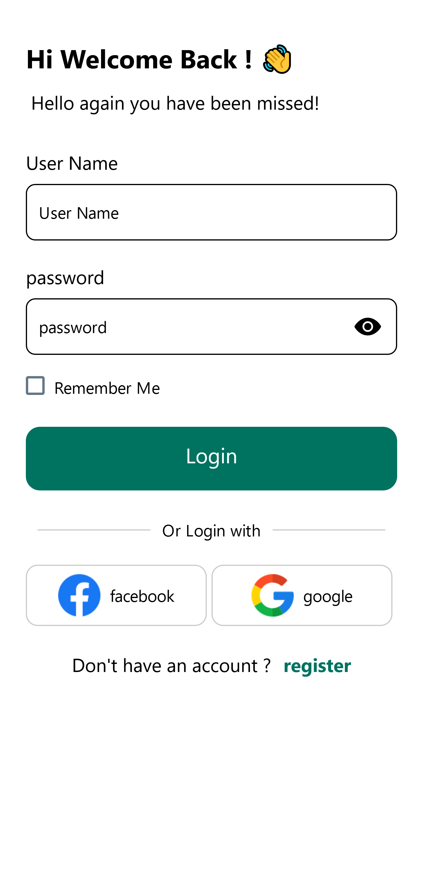
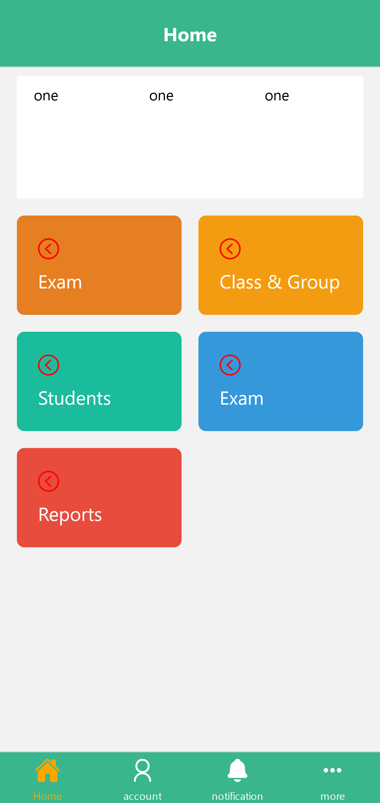
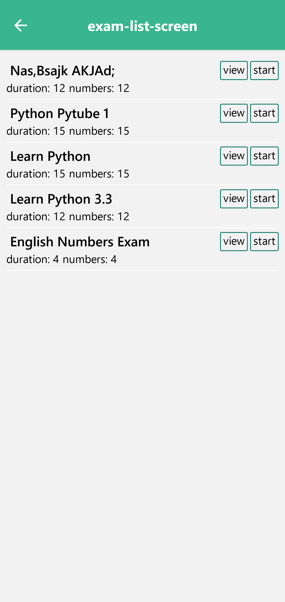
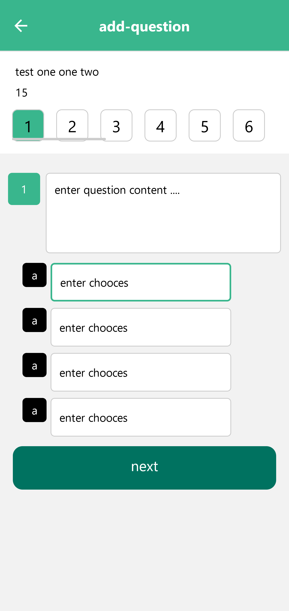

# Exam App (version 1.0.0)

Exam App is a platform for organization education members such as teacher
you can manage exams from create to result exam

## provide some features
- create exams from mind or app
- add questions
- reports for student

## Screenshots

## Project parts

| Part | Topic     | Video url                                                 | Starting Branch                                                      | Result Branch                                                         |
| ---- | --------- | --------------------------------------------------------- | -------------------------------------------------------------------- | -------------|
| 1 | prepare | 12 | start | end |
| 1 | prepare | 12 |  asdwdaqwfw start | end |
| 1 | prepare | 12 | start | end asfasfas asdas |

## Tech Stack

**Mobile**: React Native, Expo

**Backend**: Node Js, ExpressJs, Restful Apis

**Database**: Database design, mysql
